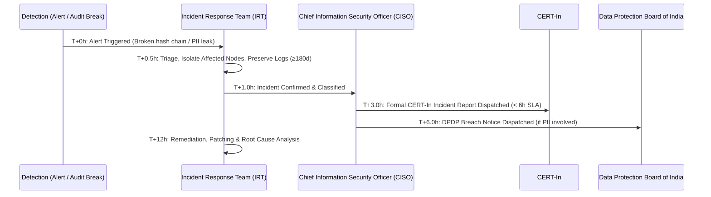

# Operational Runbook: Cyber Incident Response & CERT-In Mandatory 6-Hour Reporting

**System:** Official Appointment Management System (OAMS v2)  
**Regulatory Framework:**

- **CERT-In Directions 2022** (issued under Section 70B, Information Technology Act, 2000)
- **Digital Personal Data Protection (DPDP) Act, 2023** (Section 8(6) Data Breach Notification)
  **Classification:** Restricted / Confidential  
  **Revision:** 2.0 (September 2026)

---

## 1. Statutory Mandate & Strict 6-Hour SLA

> [!CRITICAL]
> Under Rule 20 of CERT-In Cyber Security Directions 2022, any cyber security incident must be reported to CERT-In **within six (6) hours** of noticing such incident or being brought to notice about such incident.
>
> Failure to report within the 6-hour SLA constitutes a statutory violation punishable under Section 70B(7) of the IT Act.

### Contact Details for CERT-In

- **Email:** `incident@cert-in.org.in` (Use GPG encryption for sensitive telemetry)
- **Toll-Free Helpline:** 1800-11-4949
- **Fax:** 1800-11-6969
- **Online Portal:** [https://www.cert-in.org.in](https://www.cert-in.org.in)

---

## 2. Qualifying Incident Types for Mandatory Reporting

The following incident types trigger mandatory CERT-In reporting within 6 hours:

| Category                       | Qualifying Trigger in OAMS                                                                                            |
| ------------------------------ | --------------------------------------------------------------------------------------------------------------------- |
| **Data Breach / Leakage**      | Unauthorized exfiltration, exposure, or dumping of official records, visitor PII, OTPs, or session tokens.            |
| **Audit Log Tampering**        | Detection of broken hash chain (`audit_events.hash` mismatch reported by the nightly `audit-verify` job).             |
| **Unauthorized Access**        | Compromise of local break-glass `SUPER_ADMIN` credentials, brute-forced OTP verification, or Entra SSO token forgery. |
| **Ransomware / Extortion**     | Encryption, deletion, or hostage of PostgreSQL database files, backups, or storage volumes.                           |
| **Denial of Service (DoS)**    | Prolonged saturation or outage of OAMS API or Redis preventing official appointment scheduling.                       |
| **Supply Chain Vulnerability** | Critical Zero-Day (CVSS ≥ 9.0) in core runtime dependencies (Node.js, PostgreSQL, Redis, Knex, Express).              |

---

## 3. Incident Response Protocol (Hour-by-Hour)



### Hour 0–1: Identification & Immediate Containment

1. **Declare Incident:** Security lead / On-call engineer formally opens incident ticket with severity `SEV-1`.
2. **Containment:**
   - Terminate compromised active sessions: trigger global user token revocation (`POST /api/v1/users/:id/disable` or bump `token_version`).
   - If break-glass was compromised, immediately revoke local admin credentials and disable `LOCAL_ADMIN_ENABLED=false`.
   - Isolate affected server/container network namespaces without powering down machines (to preserve memory forensics).
3. **Log Preservation:** Ensure all Pino HTTP logs, PostgreSQL WAL files, Redis command logs, and `audit_events` rows are frozen. **Per CERT-In mandate, logs must be retained for at least 180 days.**

### Hour 1–3: Investigation & Drafting CERT-In Report

1. Assess root cause, affected entity types (`users`, `appointments`, `visits`, `audit_events`).
2. Identify compromised credentials or IP ranges.
3. Fill out the **CERT-In Incident Reporting Form** (Template below).
4. Secure internal sign-off from CISO / Head of IT.

### Hour 3–6: Mandatory Dispatch & Regulatory Notifications

1. Dispatch encrypted email report to `incident@cert-in.org.in`.
2. Follow up via phone (1800-11-4949) to confirm receipt and record the CERT-In incident tracking ticket ID.
3. **DPDP Act 2023 Compliance:** If visitor personal data (name, mobile, Aadhaar last-4) was compromised:
   - Notify the **Data Protection Board of India (DPBI)** via official regulatory portal.
   - Send breach intimation email/SMS to affected Data Principals detailing:
     - Nature of breach
     - Data categories involved
     - Mitigations taken
     - Contact details of OAMS Grievance Officer

---

## 4. CERT-In Incident Reporting Form Template

```text
To: incident@cert-in.org.in
Subject: [INCIDENT REPORT] [OAMS-PROD] Under Rule 20 of CERT-In Directions 2022

1. Name of Organisation: [Organisation Name]
2. Contact Person & Designation: CISO / Information Security Officer
3. Phone / Mobile: +91-XXXXX-XXXXX
4. Email Address: security@organisation.gov.in / ciso@organisation.gov.in
5. Date and Time of Incident Detection (IST): YYYY-MM-DD HH:MM IST
6. Location / Region of Hosting: AWS / Azure India Region (Data Residency compliant)
7. Nature / Type of Incident:
   [ ] Unauthorized Access / Break-in
   [ ] Data Exfiltration / PII Exposure
   [ ] Audit Log Tampering / Hash Chain Disruption
   [ ] Ransomware / Malicious Code
   [ ] Denial of Service
   [ ] Other: ______________________

8. Affected System(s) Details:
   - Application: Official Appointment Management System (OAMS v2)
   - Impacted Components: [API Gateway / PostgreSQL Primary / Redis Cluster]
   - Public IP / Domain: oams.organisation.gov.in (IP: XX.XX.XX.XX)

9. Description of the Incident:
   [Provide factual chronology of event detection, unauthorized actions observed, and correlation IDs.]

10. Impact Assessment:
   - Number of user accounts affected: XX
   - Type of data accessed: [e.g. Appointment metadata; No personal calendar/confidential notes compromised]
   - Business service disruption: [Partial / None]

11. Immediate Containment & Mitigation Actions Taken:
   - Tokens revoked: Yes
   - Compromised IP blacklisted: Yes
   - Network isolation performed: Yes
   - Audit hash verification rerun: Yes
   - Forensics log snapshot preserved (180+ days): Yes

12. Remarks / Additional Information:
   Investigation is actively ongoing. Next update will be provided within 24 hours.

Submitted by:
[Name & Digital Signature]
Chief Information Security Officer
```

---

## 5. Post-Incident Review & Evidence Retention

1. **Root Cause Analysis (RCA):** Completed within 72 hours of incident resolution.
2. **CERT-In Follow-up:** Submit comprehensive technical closure report within 14 days or as requested by CERT-In investigators.
3. **Forensic Evidence Retention:** Store disk snapshots, memory captures, network pcap files, and log archives in an immutable, write-once-read-many (WORM) storage bucket for a minimum of **5 years**.
